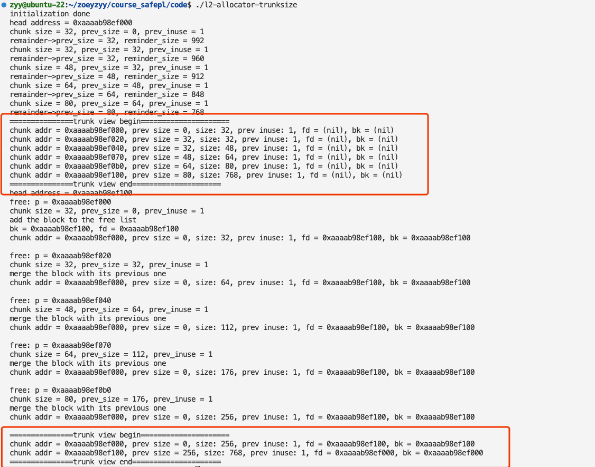

# L2 Report 
## Requirement
1. build a naive memory allocator.

## Fix
1. line 8: add `#define prev_size(p) ((p)->prev_size)` to get prev_size conveniently
2. line 125: change `clear_previnuse_at_offset(p, size);` to `set_previnuse_at_offset(p, size);` because the preinuse flag in the next chunk should be set 1 when the current chunk is freed.
3. line 128: change `if (!prev_inuse(p)) {` to `if (!prev_inuse(p) || prev_size(p) == 0)` because if the current chunk is the first chunk or the previous chunk is in use the block should be added into the free list, otherwise the block should be merged with previous one.

## Result

