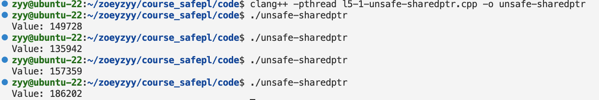
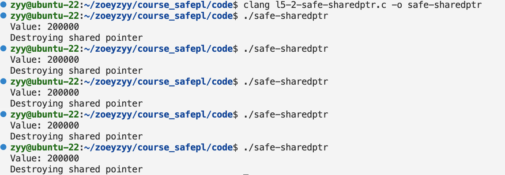

# L5 Report 
## Requirement
1. Demonstrate that std::shared_ptr in C++ is not thread-safe.
Hint: Design code that triggers an error by causing a race condition in the reference counter update.
2. (Optional) Modify the shared pointer you implemented last week to make it thread-safe.

## Experiment
1. thread-unsafe std::shared_ptr:
    1. Set shared_ptr<int> shared_int is 0 at first.
    2. Start 2 threads at same time to add shared_int 100000 times.
    3. Look at the result.
2. change shared pointer into thread-safe one:
    1. use pthread_mutex_lock to explicitly lock shared_ptr.

## Result
1. std::shared_ptr is thread-unsafe : the expected result is 200000, but the actual result is unpredictable.

2. thread-safe SharedPointer.

