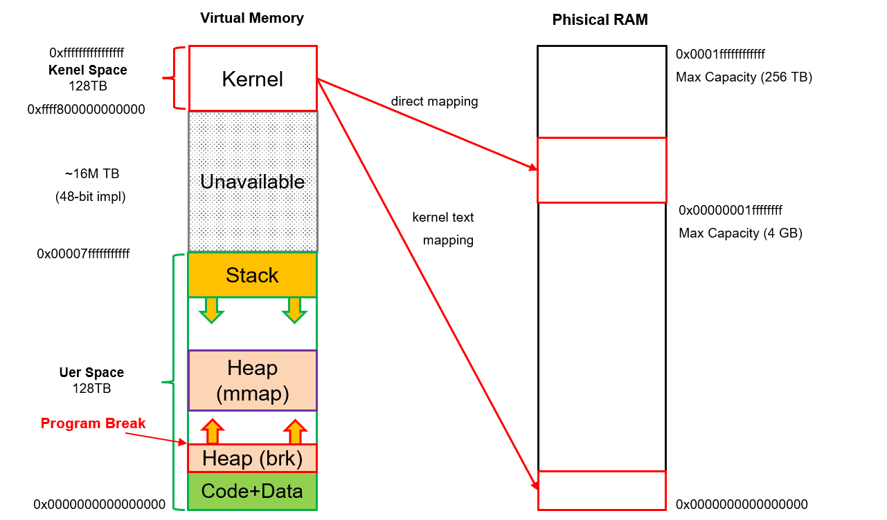

# Chapter 2. Allocator Design
## Section 2.1 Memory Management Overview
How does a process access the RAM? If there the RAM is uniquely owned by the process, it can directly read/write the RAM cells with the phisical address. However, if the RAM is shared among several processes, we should divide the phisical address space into different realms. This can be achieved either via direct segmentation (or unikernel) or virtual memory addressing. Due to the limitations in flexibility and security, unikernel is mainly used in embeded systems and LibOSes, while virtual memory addressing becomes the most popular way for PCs and Servers.

In vitual memory addressing, each process can only use the virtual address to access the memory. The virtual memory space of each process are exactly the same, and MMU on the Chip translates the virtual address of different processes to the corresponding phisical address automatically. This enforces the seperation of phisical memory usage.

The following figure demonstrates a simple mapping between the virtual memory space and phisical memory space in some X86_64 systems (48-bit version). The virtual memory spaces of X86_64 ranges from 0x0000000000000000 - 0xffffffffffffffff. While memory addresses above 0xffff800000000000 are reserved for kernel usage, and addresses below 0x00007fffffffffff are reserved for user space. Since current X86_64 solutions mainly implements the 48-bit version, memory addresses in the middle are unused. As discribed in the document of ["Complete virtual memory map with 4-level page tables"](https://www.kernel.org/doc/Documentation/x86/x86_64/mm.txt), the kernel text is mapped to phisical address 0, and there is another kernel address range directly mapped to the phisical memory space.

## Section 2.2 Kernel Space Allocator

# Section 2.3 User Space Allocator
