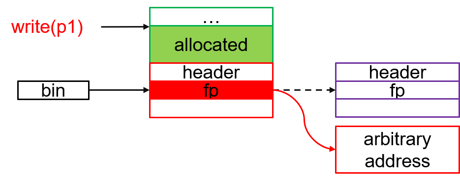

# Chapter 2. Heap Attack
## Section 2.1 Heap Analysis

## Section 2.2 Heap Attack
To simplify the attacking scenario, we assume there is one free list. Therefore, all malloc() and free() operations will be performed based on the same list. In practice, there could be several bins, and each bin could have several lists of different sized chunks, which increases the complexity of attacks.

### Heap Overflow Attack
Suppose p1 is a pointer to a heap chunk, and we can write beyond the chunk end through p1, i.e., with heap overflow issues. We may leverage the bug to modify the forward pointer of a following chunk. As shown in the figure below, the original forward pointer points to the next free chunk. To attack the bug, we can change the forward pointer to an arbitrary address of our interest.

Now, if we call the malloc(), it will remove the first chunk of the bin and point the bin head to the address of our interest.  

Calling the malloc() again would gain a pointer to the arbitrary address.

## Section 2.3 Protection Techniques
